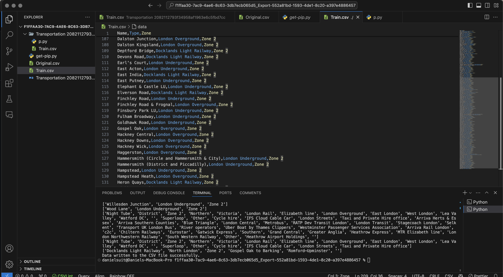
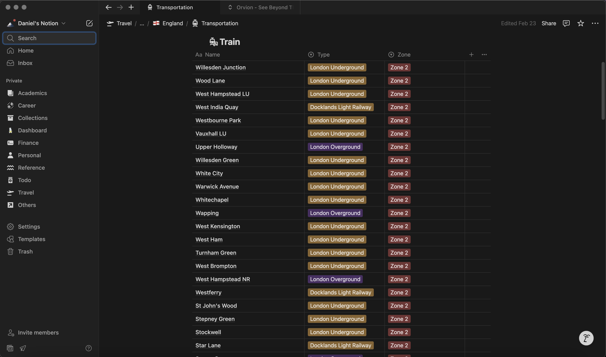

# wikitable
Parses through a wikipedia page to extract table elements to be converted into a .csv format to be imported into Notion databases

Edit the urls array in the p.py file with your specified urls. Edit the file paths in p.py with your corresponding paths. Run p.py.
